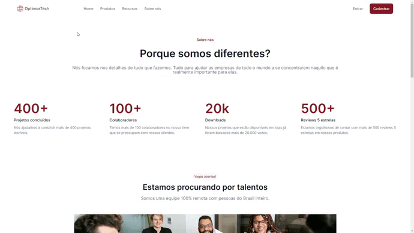

# **Optimus Tech**

## 📝 **Descrição**

Projeto desenvolvido através do [#7daysOfCode](https://7daysofcode.io/) onde os alunos são desafiados a colocar seus conhecimentos em prática, nesse desafio desenvolvi uma página de vagas de emprego utilizando HTML e CSS.

  

## 📂 **Acesso ao projeto**

Através desses links você terá acesso a [Página web](https://danoliveiradev.github.io/optimus-tech/) e acesso aos [Arquivos do projeto](https://github.com/danoliveiradev/optimus-tech).

## 🛠 **Técnicas, tecnologias e bibliotecas utilizadas**

`HTML5`
`CSS3`

## 👥 **Contribuição**

[`Giovanna Moeller`](https://instagram.com/girl.coding)
  
## 🤓 **Desenvolvedores**

| [ Daniel Oliveira](https://github.com/danoliveiradev) |
| :---: |

## 🔐 **Licença**

Este projeto está licenciado nos termos da [licença MIT](https://github.com/danoliveiradev/readme/blob/c1be2c0daacda0a944d2596ea78fbe98d37d0680/LICENSE.txt).
